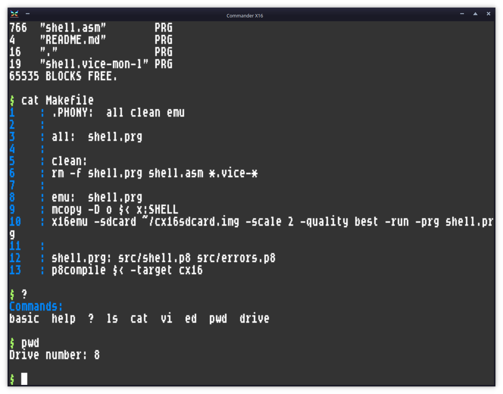

# Shell for Commander X16

Command Line Shell for Commander X16

Software License: MIT open source, see file LICENSE.

## Compiling the shell

You'll need a very recent Prog8 compiler (12.1 or newer) to build this from source.

First type ``git submodule update --init`` to fetch the external modules. 
Then just type ``make`` to compile the shell.
Type ``make run`` to compile, copy everything to the correct folders on the sdcard,
and immediately start it in the Commander X16 emulator.

Save SHELL.PRG as AUTOBOOT.X16 to the sd-card to automatically load and run the shell at startup.

## Usage

Type "help" at the prompt to get a list of available commands and aliases.
Type "man builtins" at the prompt to see the below list of the builtin commands.

| command  | explanation                                                                                                                                                                                                                   |
|----------|-------------------------------------------------------------------------------------------------------------------------------------------------------------------------------------------------------------------------------|
| alias    | create a new command alias                                                                                                                                                                                                    | 
| cat      | prints the contents of the given text file on the screen                                                                                                                                                                      |       
| cd       | change current working directory                                                                                                                                                                                              |
| cls      | clear the screen                                                                                                                                                                                                              |       
| color    | change main screen colors                                                                                                                                                                                                     |
| cp       | copy given file to new file                                                                                                                                                                                                   |
| dos      | print drive status message or perform a cbm dos drive command                                                                                                                                                                 | 
| drive    | change current drive                                                                                                                                                                                                          |       
| echo     | print something to the screen. Escape characters are \\n (newline), \\xAB to print char $AB. \\cX (X=0-4) to select text color type. \\; to not print a newline at the end. \\s=space. \\b=bell. \\\\=backslash. \\" = quote. | 
| exit     | return back to Basic prompt                                                                                                                                                                                                   |
| help     | show short list of builtin commands and aliases                                                                                                                                                                               |
| hicolor  | change highlight screen colors                                                                                                                                                                                                |
| ls       | shows files on disk. You can provide an optional pattern to match such as *.ASM or H???.TXT                                                                                                                                   |
| mem      | show some memory information                                                                                                                                                                                                  |       
| mkdir    | create a new directory                                                                                                                                                                                                        |       
| mode     | change screen mode                                                                                                                                                                                                            |
| mon      | enter the machine code monitor program                                                                                                                                                                                        |
| mv       | rename given file to given new filename                                                                                                                                                                                       |
| nano     | uses X16Edit (in Rom or on disk) to edit the given text file  (see note below)                                                                                                                                                |       
| num      | print number in various bases, accepts $hex, %binary and normal decimal                                                                                                                                                       |
| pwd      | show current drive information                                                                                                                                                                                                |       
| relabel  | change disk name                                                                                                                                                                                                              |       
| rm       | remove given file from the disk                                                                                                                                                                                               |       
| rmdir    | remove existing directory                                                                                                                                                                                                     |       
| run      | loads and executes the given file. You can omit any .PRG suffix and is case insensitive. You can also just type the name of a PRG directly to run it.                                                                         |
| shellver | prints the version of the shell program                                                                                                                                                                                       | 
| unalias  | remove an existing command alias                                                                                                                                                                                              | 

You can also type the name of an "external command" program, located in the "SHELL-FILES/commands" subdirectory.
Finally you can simply type the name of a program to launch (no file extension required, case-insensitive).
Supplied external commands:
- man  (manuals)
- hexdump  (binary file viewer)
- time  (display time)
- view  (image viewer)
- play  (sound and music player)
- neofetch  (system information)
 
You can use tab for filename completion (case-sensitive).

## Startup config script and running user scripts

If a "config.sh" script file exists in the SHELL-FILES subdirectory, this will be loaded and executed
at startup. Every line will be executed as a shell command. Empty lines or lines starting with a '#' will be skipped.
The default config.sh file contains a bunch of command aliases, sets the screen mode and changes the color scheme,
and prints a welcome message. You can change the script however you like.

Actually, any file ending with ".sh" is treated as a shell-script, in ISO character encoding,
that contains lines with shell instructions. You can execute it just by typing its full name.
Scripts existing in the "SHELL-FILES/commands" directory will be executed first.

NOTE: currently the length of a script is limited to 1 KB (not enforced). If your script exceeds this
it will overwrite program memory when loaded and cause havoc on the system.

## External commands

The shell can launch 'external commands' much like a Unix shell runs programs from disk.
You can write those commands yourself, they have to adhere to the following API.

Command should be assembled from address $4000 and up (to max $9f00).
They should be stored in the ``SHELL-FILES/commands`` subdirectory on your sdcard.

Utility routines you can call from your command program::

    extsub $07d0 = print_l(long value @ R0R1_32) clobbers(A, X, Y)
    extsub $07d3 = print_ulhex(long value @ R0R1_32, bool prefix @A) clobbers(A, X, Y)
    extsub $07d6 = drive_number() -> ubyte @A
    extsub $07d9 = txt_color(ubyte colortype @A) clobbers(A)       ; activate one of the 5 color types (constants defined below)
    extsub $07dc = version() -> uword @AY               ; returns pointer to string with shell's version
    extsub $07df = get_text_colors() -> uword @AY       ; returns address of array of 5 text color bytes (text, background, highlight, prompt, error)
    extsub $07e2 = chrout(ubyte character @A)
    extsub $07e5 = print(str string @AY) clobbers(A,Y)
    extsub $07e8 = print_ub(ubyte value @ A) clobbers(A,X,Y)
    extsub $07eb = print_ubhex(ubyte value @ A, bool prefix @ Pc) clobbers(A,X,Y)
    extsub $07ee = print_ubbin(ubyte value @ A, bool prefix @ Pc) clobbers(A,X,Y)
    extsub $07f1 = print_uw(uword value @AY) clobbers(A,Y)
    extsub $07f4 = print_uwhex(uword value @ AY, bool prefix @ Pc) clobbers(A,Y)
    extsub $07f7 = print_uwbin(uword value @ AY, bool prefix @ Pc) clobbers(A,Y)
    extsub $07fa = input_chars(uword buffer @ AY) clobbers(A) -> ubyte @Y
    extsub $07fd = err_set(str message @AY) clobbers(A,Y)

Command receives arguments at $0:BF00 (zero terminated, see  https://github.com/X16Community/x16-docs/blob/66e2cdcf6abaf00da45d0a00b7bed310319586f0/X16%20Reference%20-%2008%20-%20Memory%20Map.md#bank-0)
(you can use the cx16.get_program_args routine to retrieve them)
Command should return error status in A. You can use the ``err_set()`` routine to set a specific error message for the shell.
Command CAN use the *free* zero page locations.
Command CANNOT use memory below $4000 (the shell program itself sits there).
Command CAN use Golden Ram $0400-up to where the jump table starts (see above). 

The "ext-command.p8" source file contains a piece of example Prog8 source code of an external command.

## Todo

- make PR for the sd card image to update shell https://github.com/cx16forum/sdcard/pulls
- load .sh scripts in a ram bank instead of golden ram to avoid program corruption when script > 1KB
- github issue about folder name upper/lowercase problem
- once the unzip and xar programs fully work, can we have a version for this shell as well? They need a lot of RAM though
- new memory layout? Shell program at the top of memory (say $6000-$9f00) or split it over 2 HiRam banks so that you can load regular programs at $0801? What about the external commands? No longer forced to start at $4000 but just regular programs?

...
